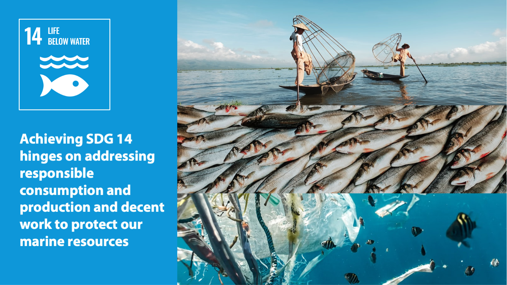
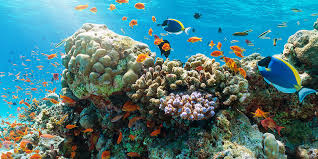
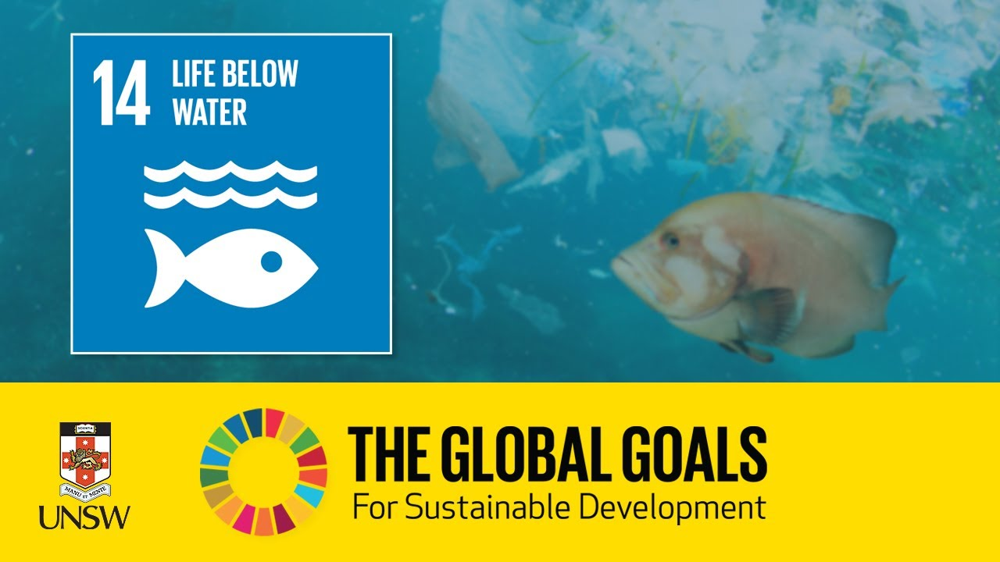

# Life Below Water

### Life Below Water: Drowning in Unsustainability - A Critical Look at Goal 14
The vast expanse of our oceans, teeming with life and mystery, holds within its depths a stark reality: Goal 14 of the Sustainable Development Goals (SDGs) – "Life Below Water" – is currently unsustainable. Established in 2015, this goal aimed to "conserve and sustainably use the oceans, seas and marine resources for sustainable development." However, despite concerted efforts, the health of our oceans continues to decline. This project will delve into the challenges threatening marine life and explore why Goal 14, in its current form, may be falling short.

### A Symphony of Threats:

The ocean faces a multi-pronged attack. Overfishing decimates populations, disrupting delicate food webs. Pollution, from plastics to agricultural runoff, chokes marine ecosystems and poisons its inhabitants. Ocean acidification, a byproduct of greenhouse gas emissions, disrupts the very building blocks of life for countless organisms. These threats, compounded by climate change, create a symphony of destruction, pushing marine ecosystems towards a tipping point.

### The Flawed Melody:

While Goal 14 outlines noble intentions, several factors undermine its effectiveness. Firstly, its voluntary nature relies on individual nations' commitment, often wavering under economic pressure. Secondly, the focus on resource utilization conflicts with the urgent need for conservation and restoration. Finally, the goal lacks binding regulations and strong enforcement mechanisms to hold nations accountable.

### Rewriting the Score:

Transforming Goal 14 into a reality requires a fundamental shift in approach. Prioritizing conservation and restoration must replace the emphasis on resource extraction. Legally binding international agreements with stringent enforcement mechanisms are crucial. Additionally, empowering local communities and indigenous knowledge can offer valuable insights and solutions.

### A New Movement:

Achieving a sustainable future for our oceans demands a global movement that transcends borders and disciplines. Public awareness needs to rise, driving individual action and fostering political pressure. Sustainable practices, from responsible seafood consumption to reduced plastic use, must become the norm. Investing in research and innovation can unlock new technologies for cleaning up pollution and mitigating climate change impacts.

### The Last Breath:

The ocean is not merely a resource to exploit; it is the very breath of our planet. Its decline threatens not only marine life but also the well-being of humanity. Revisiting Goal 14 with a renewed focus on conservation, accountability, and global collaboration is no longer optional – it is essential. Let us rewrite the melody, before the ocean's song falls silent forever.

### Project Setup:

Ensure you have the LTS Version of node package manager (npm) installed into your system. Checkout this article https://docs.npmjs.com/downloading-and-installing-node-js-and-npm if not installed yet.

> npm i

> ng serve
